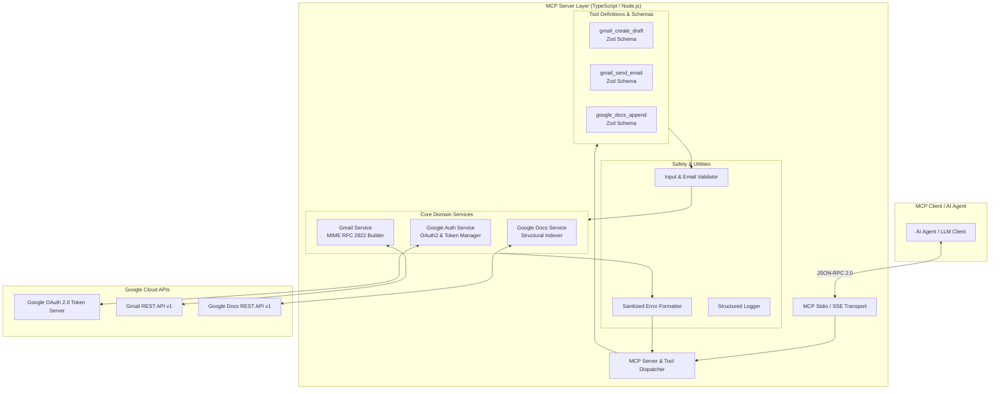
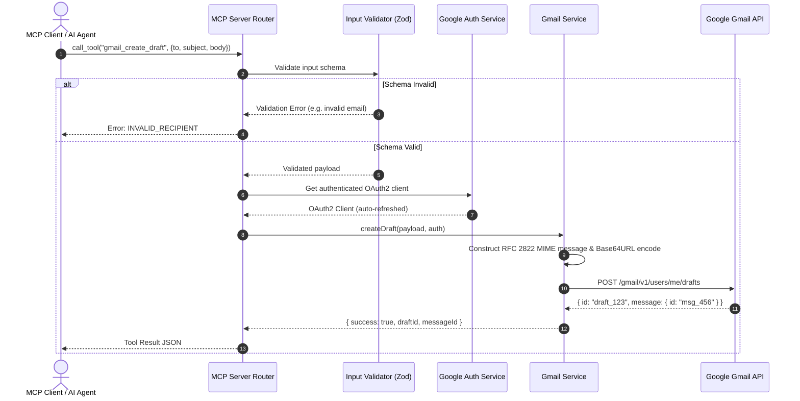
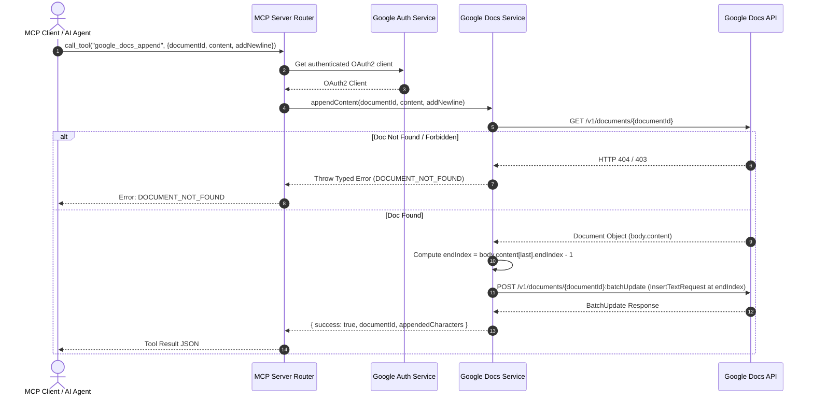

# Generic Gmail + Google Docs MCP Server - Architecture & System Design Document

## 1. Executive Summary & Design Philosophy

The **Generic Gmail + Google Docs MCP Server** is a modular, high-security bridge implementing the **Model Context Protocol (MCP)**. It exposes standardized, type-safe tools that empower any MCP-compliant AI agent or client (e.g., Cursor, Claude Desktop, Antigravity, custom LangChain/LangGraph agents) to interact safely with **Gmail** and **Google Docs** without embedding bespoke Google OAuth or REST plumbing inside client agents.

```
+-----------------------------+
|    Any MCP-Compliant AI     |
|   (Cursor / Claude / Agent) |
+--------------+--------------+
               |  MCP JSON-RPC (stdio / SSE)
               v
+---------------------------------------------------------+
|        Generic Google Workspace MCP Server              |
|                                                         |
|  +--------------------+     +------------------------+  |
|  |   MCP Tool Layer   |     |    Auth & Token Mgmt   |  |
|  | - gmail_create_draft|    | - OAuth2 Client        |  |
|  | - gmail_send_email |     | - Auto-Refresh Loop    |  |
|  | - docs_append      |     | - Encrypted Local Store|  |
|  +---------+----------+     +-----------+------------+  |
|            |                            |               |
|            v                            v               |
|  +---------------------------------------------------+  |
|  |                Google Services Layer              |  |
|  |   Gmail MIME / REST      Google Docs BatchUpdate  |  |
|  +---------------------------------------------------+  |
+--------------------------+------------------------------+
                           |  HTTPS (OAuth 2.0 Bearer)
                           v
              +--------------------------+
              |   Google Workspace APIs  |
              |     (Gmail & Docs)       |
              +--------------------------+
```

### Core Design Principles
1. **Agent-Agnostic & Reusable**: Implements standard MCP SDK conventions; requires zero client-specific adaptations.
2. **Explicit Safety & Non-Destructive Invariants**: Clear delineation between side-effect free operations (`gmail_create_draft`) and external side-effects (`gmail_send_email`). Google Docs operations are strictly append-only (no deletion or document replacement).
3. **Zero Token / Credential Leakage**: Secrets and OAuth tokens are strictly confined to the server layer; error payloads and logs sanitize all credentials.
4. **Resilient Document Indexing**: Google Docs structural indexing rules are handled natively using Docs API `batchUpdate` insertion calculations.

---

## 2. High-Level System Architecture



---

## 3. Component Breakdown

### 3.1 MCP Protocol & Transport Layer (`src/server/`)
- **Transport**: Standard JSON-RPC 2.0 over `stdio` (primary) and optional `SSE` (Server-Sent Events) for networked deployment.
- **Server Instance**: Built using `@modelcontextprotocol/sdk`. Exposes tool discovery (`tools/list`) and tool invocation (`tools/call`).
- **Capability Negotiation**: Declares tools capabilities with precise markdown descriptions and JSON schema contracts.

### 3.2 Authentication & Token Management (`src/services/googleAuth.ts`)
- **OAuth 2.0 Flow**: Implements `google.auth.OAuth2` client.
- **Token Lifecycle**:
  1. Inspects local token store (`GOOGLE_TOKEN_PATH`).
  2. If expired, automatically requests token refresh using stored `refresh_token`.
  3. If missing, launches the authorization flow or returns actionable `AUTHENTICATION_REQUIRED` MCP error.
- **Required Least-Privilege Scopes**:
  - `https://www.googleapis.com/auth/gmail.compose` (create drafts)
  - `https://www.googleapis.com/auth/gmail.send` (send emails)
  - `https://www.googleapis.com/auth/documents` (append content to docs)

### 3.3 Gmail Domain Service (`src/services/gmailService.ts`)
- **RFC 2822 / MIME Message Builder**:
  - Constructs compliant email headers (`To`, `Cc`, `Bcc`, `Subject`, `From`, `Date`, `Message-ID`).
  - Supports UTF-8 encoded text bodies with special characters and internationalization.
  - Base64URL-encodes raw MIME payloads for Gmail API ingestion.
- **Operations**:
  - `createDraft(params)`: Calls `users.drafts.create`. Guarantees draft staging without transmission.
  - `sendEmail(params)`: Calls `users.messages.send`. Performs strict pre-flight recipient verification before sending.

### 3.4 Google Docs Domain Service (`src/services/googleDocsService.ts`)
- **Structural Document Appender**:
  1. Calls `documents.get` to inspect document structure and determine terminal index (`endIndex - 1`).
  2. Handles trailing newline formatting: if the document does not end in `\n`, automatically prepends a newline to avoid concatenating into existing headings/paragraphs.
  3. Dispatches atomic `documents.batchUpdate` with `InsertTextRequest` at `endIndex - 1`.
  4. Preserves 100% of existing text, tables, styles, and document elements.

---

## 4. MCP Tools Specification

### 4.1 `gmail_create_draft`
**Description**: *Creates a Gmail draft without sending it. Use this tool when the user wants an email prepared for review, but does not explicitly ask for it to be sent.*

#### Input Schema (Zod)
```typescript
export const GmailCreateDraftSchema = z.object({
  to: z.array(z.string().email("Invalid recipient email")).min(1, "At least one recipient required"),
  cc: z.array(z.string().email("Invalid CC email")).optional().default([]),
  bcc: z.array(z.string().email("Invalid BCC email")).optional().default([]),
  subject: z.string().min(1, "Subject cannot be empty"),
  body: z.string().min(1, "Body cannot be empty")
});
```

#### Output Payload
```json
{
  "success": true,
  "draftId": "r-849201948201",
  "messageId": "18f910a8bc02e4d1",
  "message": "Draft created successfully."
}
```

---

### 4.2 `gmail_send_email`
**Description**: *Sends an email immediately using the authenticated Gmail account. This performs an external side effect and sends the message to the specified recipients. Use only when the user explicitly requests sending the email.*

#### Input Schema (Zod)
```typescript
export const GmailSendEmailSchema = z.object({
  to: z.array(z.string().email("Invalid recipient email")).min(1, "At least one recipient required"),
  cc: z.array(z.string().email("Invalid CC email")).optional().default([]),
  bcc: z.array(z.string().email("Invalid BCC email")).optional().default([]),
  subject: z.string().min(1, "Subject cannot be empty"),
  body: z.string().min(1, "Body cannot be empty")
});
```

#### Output Payload
```json
{
  "success": true,
  "messageId": "18f910a8bc02e4d1",
  "recipientCount": 1,
  "message": "Email sent successfully."
}
```

---

### 4.3 `google_docs_append`
**Description**: *Append text to the end of an existing Google Doc. This modifies the specified document by adding content at the end, but does not delete or replace existing content.*

#### Input Schema (Zod)
```typescript
export const GoogleDocsAppendSchema = z.object({
  documentId: z.string().min(1, "Document ID is required"),
  content: z.string().min(1, "Content to append cannot be empty"),
  addNewline: z.boolean().optional().default(true)
});
```

#### Output Payload
```json
{
  "success": true,
  "documentId": "1BxiMVs0XRA5nFMdKvBdBZjgmUUqptlbs74OgvE2upms",
  "appendedCharacters": 142,
  "insertLocationIndex": 842,
  "message": "Content appended successfully to Google Doc."
}
```

---

## 5. End-to-End Sequence Diagrams

### 5.1 Gmail Draft Creation Sequence



---

### 5.2 Google Docs Append Sequence



---

## 6. Directory Structure & Code Organization

```
mcp-google-server/
├── .env.example                  # Environment template
├── .gitignore                    # Prevents token/env leaks
├── package.json                  # Dependencies & scripts
├── tsconfig.json                 # TypeScript compiler configuration
├── README.md                     # Comprehensive setup, auth & client guide
├── problemStatement.md           # Product requirements document
├── architecture.md               # System design specification
├── src/
│   ├── index.ts                  # Server entrypoint
│   ├── server/
│   │   └── mcpServer.ts          # MCP Server instantiation & tool registrations
│   ├── tools/
│   │   ├── gmail/
│   │   │   ├── createDraft.ts    # gmail_create_draft handler
│   │   │   └── sendEmail.ts      # gmail_send_email handler
│   │   └── googleDocs/
│   │       └── appendContent.ts  # google_docs_append handler
│   ├── services/
│   │   ├── googleAuth.ts         # OAuth2 client & token refresh service
│   │   ├── gmailService.ts       # Gmail API & MIME message composer
│   │   └── googleDocsService.ts  # Google Docs API & structural indexing service
│   ├── schemas/
│   │   ├── gmailSchemas.ts       # Zod schemas for Gmail tools
│   │   └── googleDocsSchemas.ts  # Zod schemas for Docs tools
│   └── utils/
│       ├── errors.ts             # Typed error hierarchy & error sanitizer
│       ├── logger.ts             # Safe structured logger
│       └── validation.ts         # Email & parameter validation helpers
└── tests/
    ├── auth/
    │   └── googleAuth.test.ts    # Token refresh & error tests
    ├── gmail/
    │   ├── createDraft.test.ts   # Draft creation & MIME tests
    │   └── sendEmail.test.ts     # Send email & validation tests
    └── googleDocs/
        └── appendContent.test.ts # Structural append & indexing tests
```

---

## 7. Error Handling & Security Model

### 7.1 Application Error Mapping Matrix

| Underlying Cause | Error Code | HTTP / API Status | Agent Actionable Message |
|---|---|---|---|
| Missing/expired credentials without refresh token | `AUTHENTICATION_REQUIRED` | 401 | "Google authentication is required. Please authorize the server." |
| Invalid recipient format | `INVALID_RECIPIENT` | N/A (Pre-flight) | "Recipient email address 'xyz' is invalid." |
| Google Doc does not exist or access denied | `DOCUMENT_NOT_FOUND` | 404 / 403 | "The specified Google Doc could not be found or accessed." |
| Missing required parameters | `VALIDATION_ERROR` | N/A (Zod) | "Invalid tool arguments: [details]." |
| Google API Rate Limit / Quota Exceeded | `RATE_LIMIT_EXCEEDED` | 429 | "Google API rate limit exceeded. Please retry with backoff." |
| Google Internal Server Error | `UPSTREAM_API_ERROR` | 500 / 503 | "Google API encountered a transient error." |

### 7.2 Security Safeguards
1. **No Token Echo**: OAuth tokens, client secrets, and full private email text are never returned in MCP error traces.
2. **Deterministic Pre-flight Email Sanitization**: Rejects invalid header injections (newlines in Subject, unescaped control characters in email addresses).
3. **Idempotency Guard**: `gmail_send_email` requires explicit confirmation parameters and returns the Gmail message ID so clients can record send completion.
4. **Local Token Encryption**: Tokens stored at `GOOGLE_TOKEN_PATH` are restricted to read/write by user permissions only (`chmod 600`).

---

## 8. Client Configuration & Verification

### 8.1 Connecting to Cursor / Claude Desktop
Example client configuration (`mcpServers` block):

```json
{
  "mcpServers": {
    "google-tools": {
      "command": "node",
      "args": ["/absolute/path/to/mcp-google-server/dist/index.js"],
      "env": {
        "GOOGLE_CLIENT_ID": "your_google_client_id",
        "GOOGLE_CLIENT_SECRET": "your_google_client_secret",
        "GOOGLE_REDIRECT_URI": "http://localhost:3000/oauth2callback",
        "GOOGLE_TOKEN_PATH": "/Users/username/.config/google-mcp/token.json",
        "LOG_LEVEL": "info"
      }
    }
  }
}
```

### 8.2 Definition of Done Verification Checklist
- [x] MCP Server starts and handles `tools/list` and `tools/call`.
- [x] `gmail_create_draft` constructs MIME message and creates draft without sending.
- [x] `gmail_send_email` verifies recipients and sends message returning `messageId`.
- [x] `google_docs_append` correctly computes `endIndex - 1` and appends text without overwriting.
- [x] Zero credential leakage in error messages or logs.
- [x] Comprehensive unit tests mocking Google API responses for all failure and success paths.
