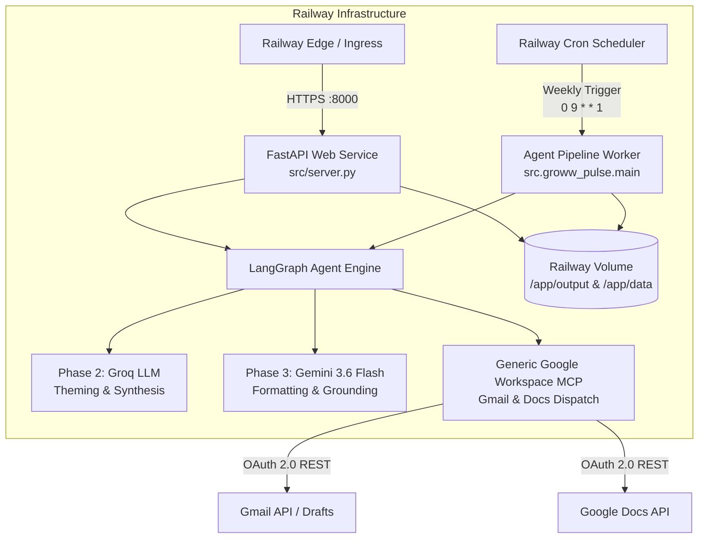

# Railway Deployment Guide: Groww Review Pulse AI & MCP Service

This guide provides step-by-step instructions for deploying the **Groww Review Pulse AI Agent** and **Google Workspace MCP Service** to [Railway](https://railway.app).

---

## 1. System Architecture on Railway



---

## 2. Prerequisites

Before deploying, ensure you have:
1. A [Railway Account](https://railway.app).
2. Git repository pushed to GitHub or GitLab.
3. Active API Keys:
   - **Groq API Key**: `GROQ_API_KEY`
   - **Google Gemini API Key**: `GEMINI_API_KEY`
4. Google OAuth Credentials & Token:
   - `GOOGLE_CLIENT_ID`
   - `GOOGLE_CLIENT_SECRET`
   - `GOOGLE_TOKEN_JSON` (or `GOOGLE_TOKEN_BASE64`) — *Generated via `.venv/bin/python3 -m src.mcp_server.main --auth`*

---

## 3. Environment Variables Reference

Configure these in **Railway Dashboard $\rightarrow$ Your Project $\rightarrow$ Variables**:

| Variable Name | Required | Example / Default | Description |
| :--- | :---: | :--- | :--- |
| `GROQ_API_KEY` | **Yes** | `gsk_...` | Groq API Key for Phase 2 structured clustering & synthesis. |
| `GROQ_MODEL` | No | `openai/gpt-oss-120b` | Groq Model (`openai/gpt-oss-120b` or `llama-3.3-70b-versatile`). |
| `GEMINI_API_KEY` | **Yes** | `AQ.Ab8...` | Google Gemini API Key for Phase 3 orchestration. |
| `GEMINI_MODEL` | No | `gemini-3.6-flash` | Gemini model name. |
| `PLAY_STORE_PACKAGE_ID` | No | `com.nextbillion.groww` | Target Android package ID on Google Play Store. |
| `WEEKS_LOOKBACK` | No | `8` | Historical lookback window in weeks (default: 8). |
| `GOOGLE_CLIENT_ID` | **Yes** | `1749752...apps.googleusercontent.com` | Google Cloud OAuth 2.0 Client ID. |
| `GOOGLE_CLIENT_SECRET` | **Yes** | `GOCSPX-...` | Google Cloud OAuth 2.0 Client Secret. |
| `GOOGLE_TOKEN_JSON` | **Yes** | `{"token": "ya29...", "refresh_token": "1//..."}` | Raw JSON token string for headless cloud authentication. |
| `DEFAULT_EMAIL_RECIPIENT` | No | `leadership@groww.in` | Default recipient for Gmail drafts and alerts. |
| `OUTPUT_DIR` | No | `./output` | Output directory for markdown & HTML deliverables. |
| `PORT` | No | `8000` | Injected automatically by Railway. |

> [!TIP]
> Run the local helper script to print formatted variables ready to paste directly into Railway:
> ```bash
> python3 scripts/export_cloud_env.py
> ```

---

## 4. Deployment Methods

### Method A: Deploy via GitHub (Recommended)

1. **Push your code to GitHub**:
   ```bash
   git add .
   git commit -m "feat: complete Groww Review Pulse AI agent with MCP server"
   git push origin main
   ```

2. **Create a new Project on Railway**:
   - Go to [railway.app/new](https://railway.app/new).
   - Select **Deploy from GitHub repo**.
   - Choose your repository (`groww-review-ai`).

3. **Configure Build Settings**:
   - Railway will automatically detect the [`Dockerfile`](file:///Users/shubham73/Documents/groww%20review%20ai/Dockerfile) and [`railway.json`](file:///Users/shubham73/Documents/groww%20review%20ai/railway.json).
   - Builder: `Dockerfile` (or `Nixpacks`).

4. **Add Environment Variables**:
   - In your Railway service, go to the **Variables** tab.
   - Click **Raw Editor** and paste the output from `python3 scripts/export_cloud_env.py`.

5. **Attach a Persistent Volume (Optional but Recommended)**:
   - In Railway Service settings, go to **Volumes**.
   - Click **Add Volume**.
   - Set Mount Path: `/app/output`.
   - *This ensures generated weekly reports and drafts persist across restarts.*

6. **Generate Domain**:
   - In the **Settings** tab $\rightarrow$ **Networking** $\rightarrow$ Click **Generate Domain** (e.g. `groww-review-pulse.up.railway.app`).

---

### Method B: Deploy via Railway CLI

1. **Install the Railway CLI** (if not already installed):
   ```bash
   # macOS (Homebrew)
   brew install railway
   
   # Or via npm
   npm i -g @railway/cli
   ```

2. **Authenticate with Railway**:
   ```bash
   railway login
   ```

3. **Initialize & Link Project**:
   ```bash
   cd "/Users/shubham73/Documents/groww review ai"
   railway init
   ```

4. **Upload Environment Variables**:
   ```bash
   # Set secrets interactively or upload from .env
   railway variables --set GROQ_API_KEY="your_groq_key"
   railway variables --set GEMINI_API_KEY="your_gemini_key"
   railway variables --set GOOGLE_TOKEN_JSON='{"token": "..."}'
   ```

5. **Deploy**:
   ```bash
   railway up
   ```

---

## 5. Setting up Automated Weekly Schedules (Cron)

To run the pipeline automatically every Monday morning to generate the weekly pulse report:

### Option 1: Railway Cron Job Service
1. In your Railway Project, click **New** $\rightarrow$ **Empty Service**.
2. Link the same GitHub repository.
3. In **Settings** $\rightarrow$ **Deploy**, set the Custom Start Command:
   ```bash
   python -m src.groww_pulse.main --weeks 8 --email "leadership@groww.in"
   ```
4. Set **Cron Schedule**:
   `0 3 * * 1` *(Every Monday at 03:00 UTC / 08:30 AM IST)*.

### Option 2: External Cron Trigger (GitHub Actions / Cron-Job.org)
Make an HTTP POST request to your Railway Web Service endpoint:
```bash
curl -X POST https://your-service.up.railway.app/api/pulse/generate \
  -H "Content-Type: application/json" \
  -d '{"weeks": 8, "email": "leadership@groww.in"}'
```

---

## 6. Available Web Endpoints

Once deployed, your service exposes the following REST API endpoints:

| Method | Path | Description |
| :--- | :--- | :--- |
| `GET` | `/` | Service status, health metadata, and API index. |
| `GET` | `/health` | Healthcheck endpoint used by Railway uptime probes. |
| `GET` | `/api/mcp/tools` | Discovers available MCP tools and JSON schemas. |
| `GET` | `/api/pulse/latest` | Returns the latest generated weekly pulse markdown note. |
| `POST` | `/api/pulse/generate` | Triggers the end-to-end Groww Review Pulse agent pipeline. |

#### Example On-Demand Trigger:
```bash
curl -X POST "https://your-service.up.railway.app/api/pulse/generate" \
     -H "Content-Type: application/json" \
     -d '{
       "weeks": 8,
       "email": "shubham@example.com",
       "use_mock": false
     }'
```

---

## 7. Verification & Post-Deployment Checklist

- [ ] **Health Check Passes**: Visit `https://your-domain.up.railway.app/health` and verify `"status": "healthy"`.
- [ ] **MCP Tools Listed**: Visit `https://your-domain.up.railway.app/api/mcp/tools` and ensure `gmail_create_draft` and `google_docs_append` are registered.
- [ ] **Trigger a Test Run**: Call `POST /api/pulse/generate` with `"weeks": 8`.
- [ ] **Verify Gmail Draft**: Open [Gmail Drafts](https://mail.google.com/mail/u/0/#drafts) and verify the staged weekly pulse email draft.
- [ ] **Review Latest Markdown**: Fetch `GET /api/pulse/latest` to verify synthesis length ($\le 250$ words) and 100% grounded verbatim quotes.

---

## 8. Troubleshooting & FAQ

### 1. `GOOGLE_TOKEN_JSON` Expired or Invalid
- **Symptom**: `401 Unauthorized` or `AUTHENTICATION_REQUIRED`.
- **Fix**: Re-run `.venv/bin/python3 -m src.mcp_server.main --auth` locally, run `python3 scripts/export_cloud_env.py`, and update the `GOOGLE_TOKEN_JSON` variable in the Railway Dashboard.

### 2. Google Play Store Scraper Rate Limits
- **Symptom**: `google-play-scraper` returns 429 or timeout.
- **Fix**: The agent includes automatic exponential backoff retry logic and fallback to cached reviews (`ENABLE_LOCAL_FALLBACK=true`).

### 3. Railway Port Binding Error
- **Symptom**: Application fails health check on startup.
- **Fix**: Ensure the start command uses `PORT=${PORT:-8000}`. Railway automatically allocates a dynamic `$PORT` environment variable.
