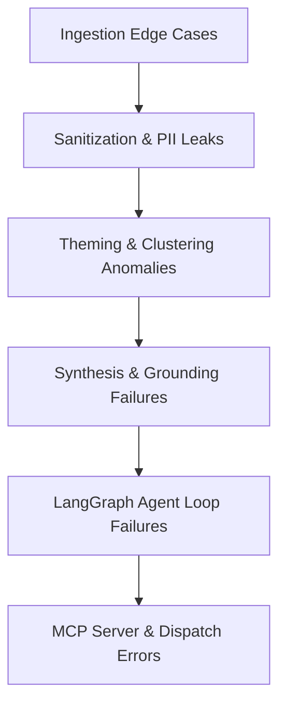

# Groww Review Pulse AI - Comprehensive Edge Cases & Failure Modes Matrix

This document details all anticipated edge cases, corner scenarios, potential failure modes, and mitigation strategies across each phase of the **Groww Review Pulse AI** system.

---

## 1. Edge Cases Matrix Overview

---

## 2. Ingestion Layer Edge Cases (`groww_pulse/ingestion/`)

| # | Edge Case / Scenario | Impact | Mitigation Strategy |
|---|---|---|---|
| **IN-1** | **Zero Reviews in Date Window** No reviews found within the last 8–12 weeks (e.g., brand-new package ID, date filter bug). | Pipeline has no data to cluster or summarize. | Check count at ingestion. If `count == 0`, raise explicit `EmptyCorpusError` with actionable suggestion to widen the lookback window or verify package ID `com.nextbillion.groww`. |
| **IN-2** | **Massive Volume Surge (10,000+ Reviews)** App store spike after major outage or marketing campaign. | Memory overload or LLM context window / token limit exhaustion. | Implement stratified sampling: prioritize reviews with high `thumbs_up` count, non-empty body text, and balanced rating distribution (1★ to 5★) capped at max 1,000 representative reviews. |
| **IN-3** | **Play Store API Rate Limiting (HTTP 429)** Scraper throttled by Google Play endpoints. | Ingestion fails abruptly. | Use exponential backoff with jitter (initial delay 2s, max 3 retries). Fall back to local cached snapshot file (`data/cache_reviews.json`) if live fetch fails. |
| **IN-4** | **Multilingual & Hinglish Reviews** Reviews written in Devanagari Hindi ("पैसे कट गए"), Romanized Hinglish ("paise kat gaye par wallet me nahi aye"), Tamil, or emoji-only. | Clustering failure or quote extraction mismatches. | Retain UTF-8 encoding end-to-end. The LLM handles Hinglish natively. Filter out reviews with $< 3$ alphabetic characters or 100% emojis before processing. |
| **IN-5** | **Malformed / Null Review Fields** Reviews with `title=None`, `text=""`, missing timestamps, or negative ratings. | `KeyError` or schema validation crash. | Pydantic data validation model with default fallbacks (`title: Optional[str] = ""`, `thumbs_up: int = 0`). Exclude empty-text reviews during initial filtering. |

---

## 3. Privacy, Sanitization & PII Scrubbing Edge Cases (`groww_pulse/sanitization/`)

| # | Edge Case / Scenario | Impact | Mitigation Strategy |
|---|---|---|---|
| **PII-1** | **Spaced / Formatted Indian Phone Numbers** User writes `+91 98765 43210`, `09876543210`, `9876-543-210`, or `nine eight seven six...`. | Phone number leaks into executive doc/email. | Multi-pattern regex covering raw 10-digit, `+91`, country-code prefixes, hyphenated/spaced variations, and word-digit mappings. Replace with `[PHONE_REDACTED]`. |
| **PII-2** | **UPI IDs, Bank Account & IFSC Codes** User writes `shubham@okhdfcbank`, `A/C 102938475612`, `SBIN0001234`. | Financial PII breach. | Targeted regex patterns for Indian UPI handles (`[\w\.-]+@(ok\w+|axis|icici|paytm|ybl|apl)`), 11–16 digit account numbers, and 11-character alphanumeric IFSC codes (`[A-Z]{4}0[A-Z0-9]{6}`). Replace with `[FINANCIAL_ID_REDACTED]`. |
| **PII-3** | **PAN & Aadhaar Numbers** User writes PAN (`ABCDE1234F`) or Aadhaar (`1234 5678 9012`). | Regulatory / statutory privacy violation. | Deterministic PAN format regex (`[A-Z]{5}[0-9]{4}[A-Z]{1}`) and 12-digit Aadhaar regex (`\b\d{4}\s?\d{4}\s?\d{4}\b`). |
| **PII-4** | **Obfuscated Email Addresses** `user [at] gmail [dot] com` or `user(at)domain.com`. | Contact info leak. | Regex pattern matcher for standard emails and bracketed/parenthetical email obfuscation techniques. Replace with `[EMAIL_REDACTED]`. |
| **PII-5** | **Reviewer Names Mentioned in Body** "Agent Suresh solved my issue" or "My name is John Doe". | PII leakage in quotes. | Strip names from author metadata (`Reviewer [Hash]`). Filter out self-identifying introductory clauses using NER/regex patterns (`My name is...`). |
| **PII-6** | **Review Becomes Empty Post-Sanitization** Review consisted solely of a phone number or email address. | Empty string passed to clustering. | Drop sanitization artifacts where `len(cleaned_text.strip()) == 0` or text contains only redaction tags. |

---

## 4. Theming & Clustering Edge Cases (`groww_pulse/theming/`)

| # | Edge Case / Scenario | Impact | Mitigation Strategy |
|---|---|---|---|
| **TH-1** | **Single Outage Dominates 90%+ of Reviews** E.g., major NSE connectivity glitch on a specific day overwhelms all 8 weeks of data. | Pulse loses visibility into other 4 core themes. | Apply theme deduplication and volume normalization: cap dominant theme representation in quotes to 1 quote maximum, forcing the remaining 2 quotes from other distinct themes. |
| **TH-2** | **Off-Topic / Regulatory Complaints** Complaints about SEBI tax changes, budget announcements, or unrelated political opinions. | Skews product-actionable clustering. | Classify into "General / External Policy" cluster and deprioritize from Top 3 actionable themes. |
| **TH-3** | **LLM Generates > 5 Themes** LLM hallucinating 7–8 granular sub-themes. | Violates hard constraint of $\le 5$ themes. | Enforce strict Pydantic schema validation (`max_items=5`) and canonical fallback taxonomy enum. Merge overflow themes into the nearest parent category. |
| **TH-4** | **Equal Tie in Theme Frequencies** Two themes have identical review counts. | Non-deterministic ranking. | Tie-breaker ranking logic: (1) Lower average star rating (higher urgency/dissatisfaction), (2) Higher aggregate `thumbs_up_count`. |

---

## 5. Synthesis, Verbatim Grounding & Validation Edge Cases (`groww_pulse/synthesis/`)

| # | Edge Case / Scenario | Impact | Mitigation Strategy |
|---|---|---|---|
| **SY-1** | **Hallucinated / Modified User Quote** LLM fixes grammar or paraphrases a user quote instead of verbatim extraction. | Violates constraint: "Real user quotes (verbatim snippets, no invented wording)". | Grounding Validator executes exact substring matching (`quote in sanitized_review_text`). If match fails, the validator flags the quote, triggering a self-correction loop in LangGraph. |
| **SY-2** | **Quote Contains Redacted Placeholders** Verbatim quote includes `[PHONE_REDACTED]` or `[EMAIL_REDACTED]`. | Looks messy in executive pulse note. | Validator prioritizes high-sentiment verbatim quotes that did not contain PII in their original text. |
| **SY-3** | **Word Count Exceeds 250 Words Cap** LLM outputs a verbose 350-word response. | Violates scannability requirement ($\le 250$ words). | Exact token/word counter in `validator.py`. If $> 250$ words, routes to LangGraph condenser node to trim descriptions while preserving exact quotes and bullet points. |
| **SY-4** | **Generic / Vague Action Ideas** LLM proposes generic actions like "Improve customer support" or "Fix bugs". | Low value for Product/Growth stakeholders. | System prompt injects concrete domain role anchors (e.g. *Product: Add UPI retry banner*, *Engineering: Optimize WebSocket stream*, *Support: Update KYC rejection reason codes*). |
| **SY-5** | **Quotes Out of Context** LLM picks a 2-word quote snippet like "Not good" that lacks context. | Poor readability and credibility. | Enforce minimum quote length ($\ge 6$ words and $\le 30$ words) representing a complete thought. |

---

## 6. LangGraph Agent State & Execution Edge Cases (`groww_pulse/agent/`)

| # | Edge Case / Scenario | Impact | Mitigation Strategy |
|---|---|---|---|
| **AG-1** | **Infinite Self-Correction Loop** Validator continuously rejects candidate pulse (e.g. LLM repeatedly generates 260 words). | Graph execution hangs indefinitely. | Set `max_retries = 3` in LangGraph state. If retry count reaches 3, execute programmatic deterministic truncation and fallback quote selection without crashing. |
| **AG-2** | **LLM API Provider Timeout / Downtime** Gemini/OpenAI API returns 500 or times out after 30s. | Workflow crashes mid-pipeline. | Implement `tenacity` retry wrapper on LLM calls with 3 attempts. Support seamless fallback to secondary model (e.g. Gemini 2.5 Flash $\rightarrow$ Gemini 1.5 Pro). |
| **AG-3** | **Malformed Structured Output (Invalid JSON)** LLM returns markdown fences around JSON or truncated JSON string. | Pydantic parsing exception. | Use LangChain's native `.with_structured_output()` with `OutputParserException` recovery handler. |

---

## 7. MCP (Model Context Protocol) Delivery Edge Cases (`groww_pulse/mcp/`)

| # | Edge Case / Scenario | Impact | Mitigation Strategy |
|---|---|---|---|
| **MCP-1** | **Google Docs MCP Server Offline / Unreachable** Stdio process not found or socket closed. | Cannot create Google Doc. | Catch MCP transport exception. Write the pulse markdown locally to `./output/groww_weekly_pulse_<date>.md` and log instructions to start MCP server. Continue to email step if possible. |
| **MCP-2** | **Gmail MCP Server Auth Expired** Underlying OAuth token on the Gmail MCP server expired. | Cannot stage draft email. | Catch MCP error. Export the formatted draft HTML to `./output/gmail_draft_<date>.html` with clear local file link. |
| **MCP-3** | **Partial Delivery Failure (Doc Created, Gmail Failed)** Doc is published, but Gmail draft fails. | Inconsistent delivery state. | Return Doc URL in console output and save full execution manifest `pulse_manifest.json` with `doc_url` so user can manually access the doc. |
| **MCP-4** | **Invalid Email Recipient Format** User passes invalid string e.g. `--email "not-an-email"`. | Gmail MCP rejects parameter. | Validate email syntax using Pydantic `EmailStr` before calling MCP tool. Default to user's configured alias. |
| **MCP-5** | **Special Characters & Markdown Formatting in Doc** Currency symbols (`₹`), markdown tables, code blocks corrupting doc format. | Broken formatting in Google Doc. | Sanitize markdown structure to standard GitHub Flavored Markdown (GFM) before sending payload to `google-docs-mcp`. |

---

## 8. Summary of Automated Defensive Guardrails

```mermaid
flowchart LR
    A[Raw Input] -->|Check 1: Non-Empty & Deduplicate| B[Clean Data]
    B -->|Check 2: PII Scrub & Noise Filter| C[Safe Corpus]
    C -->|Check 3: Max 5 Themes Taxonomy| D[Themed Clusters]
    D -->|Check 4: Verbatim Substring Match| E[Grounding Passed]
    E -->|Check 5: Word Count <= 250| F[Length Passed]
    F -->|Check 6: MCP Fallback Local Backup| G[Published Deliverables]
```

