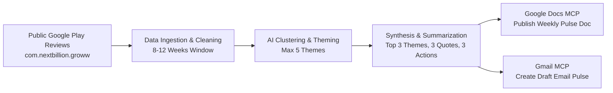

# Groww Review Pulse AI - Project Problem Statement & Context

## 1. Project Overview
The objective of this project is to build an automated pipeline and agentic workflow for the **Groww** platform ([Groww on Google Play Store](https://play.google.com/store/apps/details?id=com.nextbillion.groww&hl=en_IN)). 

The goal is to turn raw Google Play Store feedback into a weekly executive pulse that stakeholders can scan in minutes: identifying what users care about, surfacing authentic verbatim feedback, and prescribing prioritized action items.

---

## 2. End-to-End Flow ("What Done Looks Like")

1. **Pull Reviews**: Ingest recent Google Play Store reviews for Groww (`com.nextbillion.groww`) covering roughly the last 8–12 weeks.
2. **Cluster & Theme**: Group reviews into at most 5 discrete product themes (e.g., Onboarding/KYC, Payments/UPI, Statements/Reports, Withdrawals/Settlement, Order Execution/UI).
3. **Distill Weekly Pulse**: Synthesize findings into a scannable one-page note ($\le 250$ words).
4. **Publish to Google Docs**: Output the weekly pulse document via Google Docs Model Context Protocol (MCP) tool.
5. **Draft Email in Gmail**: Generate and stage a formatted draft email via Gmail MCP tool containing the pulse and pointers.

---

## 3. Key Deliverables
The **Weekly One-Page Pulse** must include:
- **Top Themes**: The top 3 dominant themes users are actively discussing.
- **Real User Quotes**: Exactly 3 verbatim, unedited snippets from real reviews (no hallucinated/invented phrasing).
- **Three Action Ideas**: Concrete, high-impact next steps directly tied to the surfaced themes.
- **Gmail Draft**: A prepared draft email containing the weekly note and doc reference.

---

## 4. Target Audience & Impact

| Audience | Key Benefit / Why |
| :--- | :--- |
| **Product & Growth** | Prioritize fixes, feature enhancements, and growth blockers from real-world user signals. |
| **Customer Support** | Align support messaging, FAQs, and triage workflows with emerging user pain points. |
| **Leadership** | Fast, high-level health check on user sentiment without wading through thousands of raw reviews. |

---

## 5. System Requirements & Specifications

### 5.1 Data Ingestion
- **Target Platform**: Google Play Store (`com.nextbillion.groww`).
- **Timeframe**: Last 8–12 weeks of reviews.
- **Data Fields**: Rating, review title, review text, date, thumbs up count, app version (if available).
- **Source**: Public review endpoints / compliant public libraries (e.g. `google-play-scraper`).

### 5.2 Theming & Synthesis
- **Theme Ceiling**: Maximum of 5 clustered themes total.
- **Highlighting**: Pulse focuses specifically on the top 3 themes.
- **Length Constraint**: $\le 250$ words for the core summary to ensure high scannability.

### 5.3 AI Agent Orchestration & Integrations (LangChain + MCP)
- **Agent Framework**: LangChain / LangGraph state graph managing the sequential pipeline: review cleaning, theme clustering, structured synthesis, guardrail validation, and tool execution.
- **MCP-First Integration**: Use Model Context Protocol (MCP) servers for Google Docs and Gmail rather than integrating bespoke OAuth client + REST plumbing. MCP tools are exposed directly to the LangChain agent.
- **Google Docs MCP**: Used for creating/updating the weekly pulse document.
- **Gmail MCP**: Used for creating the staged email draft.

---

## 6. Constraints & Privacy
- **Public Data Compliance**: Use public Google Play review exports only. No authenticated scraping behind store logins or ToS-violating scrapers.
- **Privacy & PII Removal**: Strip all Personally Identifiable Information (PII)—no reviewer usernames, emails, phone numbers, or device identifiers in generated summaries or quotes.
- **Verbatim Authenticity**: User quotes must be real extracted text verbatim from user reviews without AI modification or invention.
